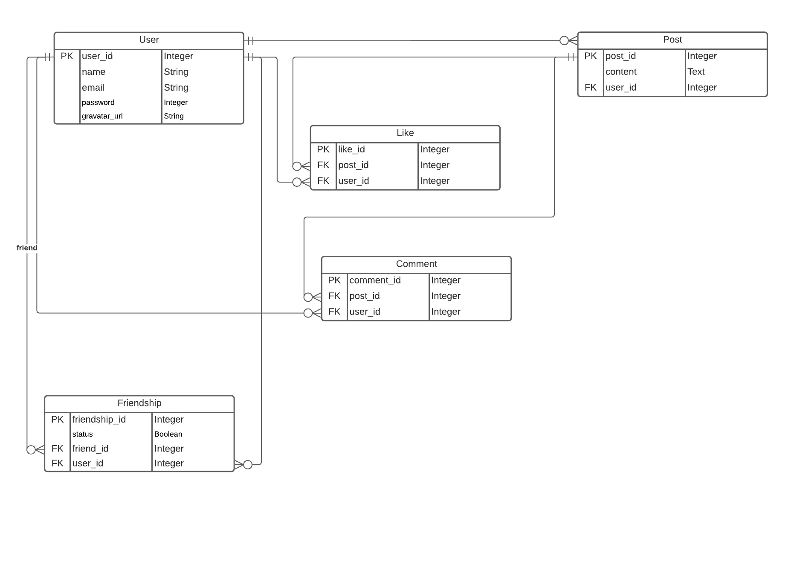

# Scaffold for social media app with Ruby on Rails

> This repo includes intial code for social media app with basic styling. Its purpose is to be a starting point for Microverse students.

## Built With

- Ruby v2.7.0
- Ruby on Rails v5.2.4

## Live Demo

https://warm-sea-11090.herokuapp.com/

## Getting Started

To get a local copy up and running follow these simple example steps.

### Prerequisites

Ruby: 2.6.3
Rails: 5.2.3
Postgres: >=9.5

### Getting started : clone the repo

To get a local copy of the repository please run the following commands on your terminal:

```
$ git clone git@github.com:CalyCherkaoui/ror-social-scaffold.git
$ cd ror-social-scaffold
$ yarn install --check-files
```

### Usage

Instal gems with:

```
$ bundle install
```

Setup database with:

```
$ rails db:create
$ rails db:migrate
```

Start server with:

```
$ sudo service postgresql restart
$ rails server
```

Open `http://localhost:3000/` in your browser.

### Run tests

```
$ rpsec --format documentation
```

> Tests will be added by Microverse students. There are no tests for initial features in order to make sure that students write all tests from scratch.

### Deployment

TBA

# Data Models



# Authors

👤 **Asiimwe Dismas**

- Github: [@asiimwedismas](https://github.com/asiimwedismas)
- Twitter: [@asiimwedismas](https://twitter.com/asiimwedismas)
- Linkedin: [asiimwedismas](https://www.linkedin.com/in/asiimwedismas/)

👤 **Houda Cherkaoui**

- Github: [@CalyCherkaoui](https://github.com/CalyCherkaoui)
- Twitter: [@Houda59579688](https://twitter.com/Houda59579688)
- Linkedin: [Houda-Cherkaoui](https://www.linkedin.com/in/houda-cherkaoui-64106395/)

## 🤝 Contributing

Contributions, issues and feature requests are welcome!

## Show your support

Give a ⭐️ if you like this project!

## Acknowledgments

## 📝 License

MIT
